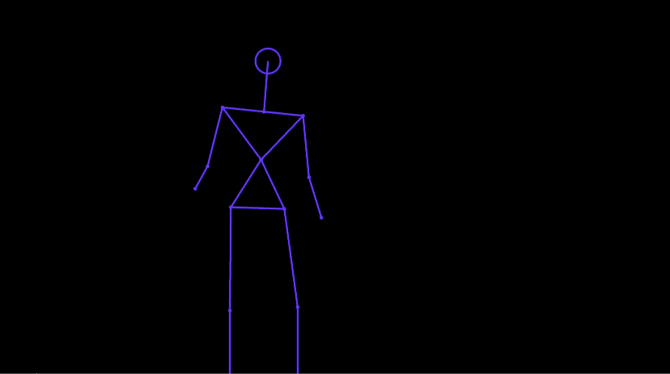

 
<h1 align="center">Kinect Skeleton Experiments</h1>
<h3 align="center">Processing experiments 💭 around skeleton tracking 💀 with Kinect 📹</h3>
 
 
 

 

### Goal
Provide a "starter kit" for Kinect *skeleton tracking*, and adding some cool features ! 💥

### Ideas
- [ ] A skeleton moving with "easing movements" ➰
- [ ] Faces, arms, legs... draw and projected on a skeleton 👹
- [ ] A hand-drawer skeleton ✏️
- [ ] A skeleton interacting with generate environment (or 3D objets) 🙌
- [ ] Skeletons interacting with each others 💀👉💀

### Debugging Mode
The function `displayInfos(boolean)` allows you to see if the Kinect detects users, what are the numbers of users, if the tracking is successful...etc. You can turn it on/off with `true` or `false` as a parameter.

### Models and Versions
- Currently working with **Kinect V1 (Model 1414)** but I will add a **Kinect V2** version in the future.
- Processing version : **2.2.1** (if you are using Kinect V2 -> **3.2.4**)
- For Kinect V2 -> **Windows 8** or **Windows 10** *and* **Kinect V2 SDK**

### Libraries

For **Kinect V1** (Xbox 360, model **1414**)

- Simple OpenNI (version 1.96)
- OpenCV for Processing
- Blob Detection *by Julien Gachadoat*

For **Kinect V2** (Xbox One, model **1520**)

- [Kinect PV2](http://codigogenerativo.com/kinectPV2/) *by [Thomas Sanchez Lengeling](http://codigogenerativo.com/)*

### To Do
- [ ] Write a better kinect class, more clear and easier to use 
- [ ] Add a Kinect V2 version
- [ ] Add face tracking to skeleton (V2 only) + draw the face

### References
[**Making Things See**] (http://makingthingssee.com/) by *Greg Borenstein* 

### Licence
GNU 3.0
